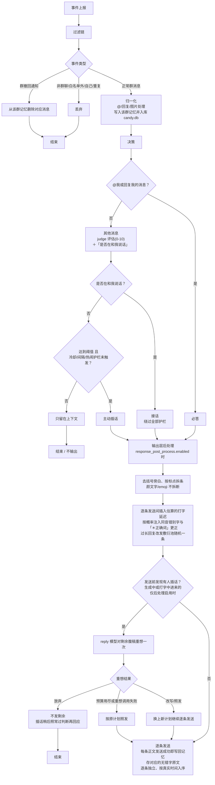

# CandyBot

一个通过 SnowLuma 参与 QQ 群聊讨论的 AI 机器人。

- **收消息**：SnowLuma 通过 OneBot v11 HTTP POST 把事件上报到 CandyBot 内置的 aiohttp 服务；
- **发消息**：直接调用 SnowLuma 的 OneBot v11 兼容 HTTP API（`POST {endpoint}/send_group_msg` 等，请求体为 JSON 参数、响应为标准 OneBot 信封；accessToken 以 `Authorization: Bearer` 头携带）；
- **大脑**：OpenAI 兼容 API。`judge` 模型逐条评估「是否值得回复这条消息」打 0-10 分，超过阈值才插话，并同时识别「这条消息是否在和我说话」（对话中的追问不受冷却限制）；@机器人/回复机器人必答，由 `reply` 模型生成回复；可选 `vision` 模型把图片转成文字描述；`learning` 模型（默认继承 `judge`）在后台总结每日群印象、学习群友的表达与黑话。
- **命令插件**：以 `/` 开头且命令名命中注册表的消息不走大模型，按 unix 终端命令风格解析参数后调用插件（`plugins/` 目录放一个 .py 即自动加载），插件返回的消息原样发到群里；未知 `/命令` 照常交给大模型。详见下文「命令插件系统」。

## 快速开始

```bash
uv sync                          # 安装依赖
uv run pytest                    # 跑测试
uv run main.py                   # 启动
```

### 前置条件

1. **SnowLuma 实例**已部署并登录 QQ（WebUI 默认 <http://127.0.0.1:5099>）。
2. 在 SnowLuma WebUI 的「网络适配器」里：
   - **HTTP 服务端**已启用（默认 http://127.0.0.1:3000/ ），记下 accessToken；
   - **HTTP 上报（client）** 新增一条，URL 填 http://127.0.0.1:5700/onebot/event ，勾选消息事件。
3. 编辑 `config.json5`（JSON5 格式，支持 `//` 注释；见下文逐项说明），至少改掉 `bot.self_qq`、`ai_backend.api_key`、`snowluma.api_key`，并把要服务的群号写进 `groups` 且 `enabled: true`。

## 配置项说明（config.json5）

| 段                    | 字段                                                               | 说明                                                                                                                                                                                                                                                                                                       |
|-----------------------|--------------------------------------------------------------------|------------------------------------------------------------------------------------------------------------------------------------------------------------------------------------------------------------------------------------------------------------------------------------------------------------|
| bot                   | self_qq                                                            | 机器人自己的 QQ 号，用于识别 @我 / 回复我 / 过滤自己消息                                                                                                                                                                                                                                                   |
|                       | listen_host / listen_port                                          | 事件上报服务监听地址（默认仅本机）                                                                                                                                                                                                                                                                         |
|                       | event_secret                                                       | 非 null 时校验上报请求的 HMAC-SHA1 签名（OneBot v11 标准）                                                                                                                                                                                                                                                 |
|                       | data_dir                                                           | 记忆等运行时数据的目录                                                                                                                                                                                                                                                                                     |
|                       | log_level                                                          | 日志级别：DEBUG/INFO/WARNING/ERROR/CRITICAL（默认 INFO）。设 DEBUG 可查看每次 LLM 请求的完整 prompt 与收到的消息                                                                                                                                                                                           |
|                       | self_nickname                                                      | 机器人昵称（默认「糖糖」）：自发言写回记忆的昵称、@我/回复我的占位文本都用它；与 persona 里自称的名字保持一致即可（改完即时生效）                                                                                                                                                                          |
|                       | max_event_body_bytes                                               | 事件上报请求体上限（字节，默认 1048576 即 1MB）：带大图数据的事件正文可能超限被拒（413），按需调大；随 aiohttp 监听一同绑定，**改动需重启**                                                                                                                                                                 |
| groups                | （群号为键）                                                       | **白名单**。只有列出的群会被服务；条目内可覆盖下表全部人设与护栏参数，留空/-1/null 表示继承 groups_default；`enabled: false` 单独禁用该群                                                                                                                                                                  |
|                       | — 特例                                                             | `groups` 为空对象且 `groups_default.enabled=true` 时服务所有群（不建议）                                                                                                                                                                                                                                   |
| groups_default        | persona                                                            | 人设；以下护栏参数缺省(-1)时使用内置默认值：                                                                                                                                                                                                                                                               |
|                       | proactivity_threshold                                              | judge 打分达到该值才主动发言（0-10）                                                                                                                                                                                                                                                                       |
|                       | cooldown_seconds                                                   | 主动发言后的冷却秒数，冷却期内直接跳过判定（@必答不受限）                                                                                                                                                                                                                                                  |
|                       | context_size                                                       | 喂给模型的上下文消息条数（默认 20）                                                                                                                                                                                                                                                                        |
|                       | min_gap_messages                                                   | 自己上次发言后需攒够这么多条他人消息才会再次评估主动发言（默认 3）；0 关闭                                                                                                                                                                                                                                 |
|                       | busy_rate_per_min                                                  | 最近 60 秒群内消息达到该条数即整体静默（默认 6），避免在多人接龙时硬插话；0 关闭                                                                                                                                                                                                                           |
| ai_backend            | base_url / api_key                                                 | 全局默认提供商：models 条目未写 base_url / api_key 时继承这里；api_key 也可留空改经环境变量 OPENAI_API_KEY 提供（本地无密钥端点自动用占位符）                                                                                                                                                              |
| models                | judge                                                              | 判断是否参与话题的模型（建议便宜快速的，如 glm-4-flash）。三种角色可来自不同提供商，见下行                                                                                                                                                                                                                 |
|                       | reply                                                              | 参与回答生成回复的模型。每个角色既可写模型名字符串（继承 ai_backend），也可写对象覆盖 `base_url` / `api_key`，并配置 `context_window`（上下文窗口，token，用于约束历史长度）与 `max_output_tokens`（单次输出上限）                                                                                         |
|                       | vision                                                             | 视觉模型：describe 模式的转述、direct 模式收图入库时的总结/保留判定（含表情包 sticker 判定、开启审核时同一次调用顺带产出表情包「可否收藏 + 描述 + 情绪」）与表情包收藏审核都靠它；同样支持按模型覆盖提供商与限额                                                                                                                                                                                                  |
|                       | learning                                                           | 学习任务模型：每日群印象总结、表达/黑话学习与自审、表情包 smart 跟发选图都靠它（建议与 judge 同为便宜快速的模型）；**不配置则继承 judge 的配置**；同样支持对象写法覆盖提供商与限额                                                                                                                                                |
|                       | embedding                                                          | 向量模型（可选，无继承）：表达选取走 `learning.expression_selection_mode: "vector"` 时用它把聊天语境与表达条目向量化（OpenAI 兼容 `/embeddings`）；写法与 judge/reply 一致（字符串或对象，继承 `ai_backend`）。**`vector` 模式未配置该角色会启动即报错**，不做静默降级                                                                                                    |
|                       | （各角色均可加 `tool_use`）                                        | 模型是否支持工具调用（默认 `true`）。判定/回复/入库评估默认经强制工具调用提交结构化结果；`false` 时该角色走纯文本协议（judge 在正文输出 JSON，reply 用末尾 `<drop_img>/<recall_img>` 标记），提示词契约随之一致。运行中若端点报工具相关错误或忽略 `tools` 参数，该角色也会自动降级为纯文本协议并记警告日志 |
|                       | （各角色均可加 `forced_tool_choice`）                              | 是否强制指定工具（`tool_choice=required`，默认 `true`）。思考（thinking）模式的模型普遍不支持 required/object 强制指定（如 qwen3 系列直接报 400）：这类模型设为 `false`，请求改用 `tool_choice="auto"` 并由提示词引导模型主动调用；模型没调用工具时同样自动降级为纯文本协议                                |
| generation            | reply_max_tokens / temperature                                     | 回复生成长度与随机性（reply 模型配置了 max_output_tokens 时以其为准）                                                                                                                                                                                                                                      |
|                       | max_context_chars                                                  | 喂给模型的历史上下文总字符上限                                                                                                                                                                                                                                                                             |
|                       | timeout_seconds                                                    | 单次 LLM 调用超时                                                                                                                                                                                                                                                                                          |
|                       | recheck_enabled / recheck_min_score                                | 门槛复核（复评）开关与触发下限：首评分严格高于下限却未达群门槛时把真实门槛告知 judge 再裁一次（默认开 / 下限 5，范围 0-10）                                                                                                                                                                                |
|                       | freshness_check_enabled                                            | 发送前新鲜度检查（默认开）：回复生成期间有明确指向 bot 的新消息（@我/回复我）进入记忆时，并入最新上下文重生成一次（每条回复至多一次）；普通新话题不触发。关闭时行为与引入前一致                                                                                                                           |
|                       | observe_band / observe_delay_seconds                               | 观望（默认 2 分 / 45 秒）：终评分落在 [门槛-observe_band, 门槛) 且未被护栏直接终止的消息不直接放弃，延迟 observe_delay_seconds 秒后取届时最新上下文重判一次（每条消息至多一次，二次判定走完全相同的护栏与配额路径）；observe_band=0 关闭                                                                                    |
|                       | repetition_guard_enabled                                           | 重复抑制（默认开）：生成前若目标消息之后已有自己的发言、且对方没再开口，在 L4 注入「你刚刚已经回复过这条消息，不要和之前的发言重复」的提醒（不拦截发送，把取舍交给模型）                                                                                                                                   |
|                       | multiple_probability / multiple_reply_style                        | 临时随机风格（默认概率 0 关闭 / 列表缺省用内置 5 条群聊风格示例）：每条回复独立掷点，命中时随机抽一条注入 L4（「【临时风格】本次回复请遵循这个额外风格：用 1-2 个字进行回复」），打破固定腔调；概率 0 或列表为空即关闭；AI 味重生成时沿用同一条风格、不再重掷 |
|                       | ai_flavor_rules / ai_flavor_retries                                | AI 味拦截（默认开，内置 6 条正则）：回复清洗完成后检测「作为AI/人工智能/语言模型」「很高兴为您服务」腔、「以下是」开头、markdown 加粗/标题/行首列表等残留，命中则把被拦截回复与原因附进 L4 重生成，至多 ai_flavor_retries 次（默认 1，0 关闭整个环节；`ai_flavor_rules: []` 同样关闭）；重试后仍命中则放行并记 warning，绝不死循环。规则按 MULTILINE 编译，必须为合法正则。此为内容级重试，与网络重试相互独立 |
|                       | max_history_images                                                 | direct 模式下历史层最多同时传入的原图张数，超出从最旧的开始摘除（默认 8）                                                                                                                                                                                                                                  |
|                       | judge_temperature / describe_temperature / assess_temperature / learning_temperature | 各角色采样温度（默认 0.2 / 0.3 / 0.2 / 0.3，范围 0~2）：reply 用上面的 temperature，其余角色此前固定在代码里，现已可分别配置                                                                                          |
|                       | generate_max_attempts / generate_retry_base_delay                  | 生成回复的网络重试（默认 2 次尝试 / 首次退避 2.0 秒，逐次 ×2）；与 ai_flavor 的内容级重试相互独立                                                                                                                       |
|                       | max_reconsider_per_burst                                           | 一轮连发被打断后最多几次「重想」（默认 2）：预算用尽后剩余腹稿按原计划发完；0 关闭重想                                                                                                       |
| multimodal            | mode                                                               | `placeholder` 图片→"[图片]"；`describe` 视觉模型转文字；`direct` 图片 base64 直传并支持图片记忆管理（要求 reply 模型多模态）。三种模式下图片 base64 都会随聊天记录入库，重启不丢失                                                                                                                         |
|                       | download_media                                                     | 是否下载图片。关掉后连本地存档也没有，所有模式一律只见占位符                                                                                                                                                                                                                                               |
|                       | download_timeout_seconds / max_image_bytes / max_images_per_message | 图片下载参数（默认 15 秒 / 8MB / 单条消息至多 4 张）：单张下载超时、超过字节上限放弃、防刷屏限张数                                                                                                              |
| storage               | image_retention_days                                               | 聊天原图保留天数（默认 7）：超期自动回收为总结/占位符；文本历史永久保留。整段可省略                                                                                                                                                                                                                        |
| learning              | enabled                                                            | 记忆与学习总开关（每日群印象 + 表达学习 + 黑话学习，见下文「记忆与学习机制」）。整段可省略、全部走默认值                                                                                                                                                                                                   |
|                       | impression_enabled / impression_days / impression_max_chars        | 每日群印象单项开关 / 注入 L2 的最近印象天数（默认 3）/ 单日印象字数上限（默认 300）                                                                                                                                                                                                                        |
|                       | expression_enabled / expression_batch_size / expression_max_inject | 表达学习单项开关 / 同群被热缓存淘汰的消息攒够多少条触发一次后台学习（默认 10）/ 单次回复最多注入 L4 的表达条数（默认 3，两种选取方式共用）                                                                                                                                                                 |
|                       | expression_self_review                                             | 是否对学到的表达条目做 AI 自审、过滤低质量与不当内容（默认开）                                                                                                                                                                                                                                             |
|                       | expression_selection_mode                                          | 表达条目注入前的选取方式（默认 `weighted_random`，行为与引入语义检索之前完全一致；`vector` 按当前聊天语境做 embedding 语义召回，须配置 `models.embedding`，否则启动即报错）。vector 模式：top_k 与相似度阈值过滤后仍在存活候选内加权随机（保留随机性），全部低于阈值则本次不注入（宁缺毋滥）；运行期 embed 调用失败记 WARNING、本次退回加权随机 |
|                       | expression_vector_top_k / expression_min_similarity                | vector 模式语义召回的候选数（默认 10）/ 相似度下限（默认 0.30，范围 0~1，低于它视为语境无关）                                                                                                                                                                                                              |
|                       | jargon_enabled / jargon_max_entries / jargon_max_inject            | 黑话学习单项开关 / 每群黑话条目上限（默认 50，超限淘汰最久未命中的）/ 单次回复最多注入 L4 的命中黑话条数（默认 5）                                                                                                                                                                                         |
|                       | pending_buffer_factor / impression_text_budget                     | 被淘汰消息缓冲容量 = 批大小 × 该系数（默认 3，溢出丢最旧）/ 每日印象总结送入的聊天文本字符预算（默认 6000）                                                                                                       |
|                       | jargon_candidates_per_batch / jargon_meaning_max_chars             | 每批黑话学习实际做双路推断的候选数上限（默认 5，每候选至少 3 次 LLM 调用）/ 黑话含义入库长度上限（默认 200 字）                                                                                              |
| stickers              | enabled                                                            | 表情包总开关（默认开）：关掉既不收集也不跟发。整段可省略、全部走默认值。详见下文「表情包」                                                                                                                          |
|                       | send_probability                                                   | 成功发送一条文字回复后跟发一张表情包的概率（默认 0.05；0 关闭跟发，收藏仍照常积累）                                                                                                                                                      |
|                       | max_count                                                          | 全局收藏上限（跨群合计，默认 64）：超限替换最久未使用的条目，记录、描述 meta 与图片文件一起删                                                                                                                                            |
|                       | moderation_enabled                                                 | 收藏是否过一次 vision 审核（默认开）：不合格（违规内容/真人照片/截图/二维码/广告等）不收藏，通过则同一次调用产出的「描述 + 情绪」入 sticker_meta 表；vision 未配置或审核失败时维持无审核收藏（该条目只参与随机兜底）。direct 模式与入库评估合并为一次调用。现读 |
|                       | select_mode                                                        | 掷点命中后的选图方式（默认 `random`，行为与引入模型选图前完全一致）：`smart` 把该群有 meta 的候选连同最近聊天与刚发出的回复交给 `learning` 模型按语境选一张，**模型可以不发**（语境不合时作罢）；无候选、模型没配好或调用失败退回随机抽选。现读 |
|                       | smart_max_candidates                                               | smart 模式单次送选的候选数上限（默认 25）：按「最久未使用优先」截取后乱序编号，避免总用同一批。现读                                                                                                                                      |
|                       | max_side_px / summary_keywords                                     | 识别启发式（默认 512px / 表情包·梗图·斗图·动图·meme）：placeholder 模式按「较长边不超过该像素」判表情包；describe 模式总结文本含任一关键词（忽略大小写）即收集；`summary_keywords: []` 表示后者永不命中 |
|                       | send_mode                                                          | 跟发时 image 消息段引用图片的方式（默认 `base64`，现读、改完热重载即对之后的跟发生效）：`base64` 把图片字节内嵌进发送请求，**SnowLuma 与 CandyBot 不同机也能发**；`http` 发 CandyBot 事件服务上的只读外链（须配 `http_base_url`）；`file` 用 `file://` 本机绝对路径，要求端点能读到本机磁盘（同机或共享磁盘，即引入前两种模式之前的行为） |
|                       | http_base_url                                                       | 仅 `send_mode: http` 用到：CandyBot 事件服务对 SnowLuma 可达的基址（如 `http://192.168.1.20:5700`，可带反向代理路径前缀、不能带查询串；只允许 http/https，内网地址放行——该 URL 由 SnowLuma 侧取图，CandyBot 自身从不请求它） |
| plugins               | enabled                                                            | 命令插件总开关（默认开）：关掉后 `/` 开头的消息完全走大模型，行为与引入命令功能前一致；改完即时生效（整段可省略走默认值，详见下文「命令插件系统」）                                                                                                            |
|                       | dir                                                                | 插件目录（默认 `plugins`，相对工作目录）：启动时逐个导入其中的 .py，下划线开头的文件跳过；新增/修改插件需重启                                                                                                                                     |
|                       | timeout_seconds                                                    | 异步 handler 的执行超时（默认 30 秒，最小 1）：超时按失败回一句提示，防止坏插件卡死该群队列；现读，改完即时生效                                                                                                                                       |
|                       | include_commands_in_history                                        | 插件产生的消息（被判定为命令的用户消息与机器人对命令的回复）是否送入模型历史上下文（默认 true）：false 时两者仍照常入库（带 `is_command` 标记，审计与每日印象统计可用），只是不出现在 judge/reply 的历史层里、不占 `context_size` 名额；现读，改完即时生效（对已入库的历史命令消息同样生效）                                                                 |
| rate_limit            | global_daily_limit                                                 | 全局每日主动发言上限，null 不限（@必答不受限）。一条正文都没实际发出（重想全部放弃或首条即发送失败）时不计数，会退还配额                                                                                                                                                                                   |
| response_post_process | enabled                                                            | 输出层拟人化后处理总开关（默认 true）。`false` 时回复整条单发、无任何延迟、不触发连发被打断后的重想，行为与未引入后处理前完全一致；整段配置可省略                                                                                                                                                          |
|                       | typing_speed                                                       | 打字延迟全局倍率（默认 1.0，0 关闭延迟；须为非负有限数）：第 2 条起按下一条文本的估算打字时长 sleep 后再发送，单条封顶 60 秒                                                                                                                                                                               |
|                       | max_split / max_length                                             | 一次回复最多拆成几条（默认 3，超出上限的句子并入最后一条）；单条超过该字数（默认 120，按显示字数计：emoji/颜文字序列整体算 1 字）则不发送原文，改从敷衍池随机抽一条（默认 7）                                                                                                                              |
|                       | keep_strong_punctuation                                            | 拆条时句末 `! ?`（含全角 `！ ？`）是否保留（默认 true）；其余句末标点（。 ， ； … 等）总是去掉                                                                                                                                                                                                             |
|                       | typo_error_rate / typo_tone_error_rate / typo_word_replace_rate    | 错别字三率（默认 0.05 / 0.3 / 0.2）：单字同音替换概率、替换时打错声调的概率、整词替换为同音词的概率（基于 pypinyin）                                                                                                                                                                                       |
|                       | typo_polyphone_mode                                                | 多音字错字策略（默认 `word_reading`）：`word_reading` 取词典词内读音照常替换（「银行」的行按 háng 出同音错字）；`skip` 多音字整体跳过、只替换单读音字。两种模式下读音无法确定时（多音字单独成词等）都绝不替换，避免产出读音对不上的「假同音」错字                                                          |
|                       | typo_correction_probability                                        | 出现错字后追加一条「＊正确词」更正消息的概率（默认 0.5）。更正经 OneBot v11 reply 消息段引用最后一条正文发送（响应无 message_id 时退回无引用纯文本并记警告）。更正只面向群友：写回记忆的是无错字原文，错别字不进入 L3 历史                                                                                 |
|                       | lazy_replies                                                       | 敷衍池（默认 呃呃/不晓得/懒得说/不知道/emm）：回复过长或清洗后无内容时随机抽一条代替发送                                                                                                                                                                                                                   |
|                       | typing_cjk_seconds / typing_latin_seconds / typing_special_seconds / typing_single_multiplier / max_typing_delay_seconds | 打字延迟的单字耗时模型（默认 0.3 / 0.15 / 1.0 秒、单字回复 3 倍、单条封顶 60 秒）：中文全角每字、半角每字、emoji/颜文字每块的估算耗时，总时长再乘 typing_speed |
| snowluma              | endpoint                                                           | SnowLuma OneBot v11 兼容 HTTP API 基址（每个 action 走 `POST {endpoint}/{action}`）；**允许私网需显式设置 allow_private_endpoint=true**                                                                                                                                                                                                                              |
|                       | api_key                                                            | accessToken，作为 `Authorization: Bearer` 头随每个 HTTP 请求发送；留空则不带鉴权头                                                                                                                                                                                                                                                                    |
|                       | send_max_attempts / send_retry_delay_seconds                       | 发送重试（默认 3 次尝试 / 首次退避 1.5 秒，逐次 ×2）：发送时现读，改完即时生效（不同于本段其余字段需重启）                                                                                                                                                                                                |

机器人昵称由 `bot.self_nickname` 配置（默认「糖糖」）：自发言写回记忆的昵称与 @/回复占位文本都用它，若 persona 里另取了名字，把这里改成一致即可（改完即时生效）。

## 配置热重载

程序监听 `config.json5` 所在目录（而非文件本身，编辑器原子保存会替换 inode、单文件 watch 会静默失效），保存后自动重新解析并替换运行时配置，日志出现「配置文件被修改，正在重载」即成功；配置写坏时完整记录解析错误并沿用旧配置继续运行，修好再保存自动恢复（替换动作在事件循环线程上执行，与消息处理串行）。

- **改完即时生效**：`groups` 白名单（增删群、启停）、persona 与各群覆盖参数、护栏阈值、`context_size`、`models`（端点/密钥/限额，会重建 AI 客户端，工具协议降级状态随之重置；含 `models.embedding`——embedding 模型变更后表达向量缓存整体作废、由学习入库/下次启动的后台补算按新模型重算）、`generation`（含各角色温度、生成/重发重试与重想预算）、`multimodal` 的下载参数、`response_post_process`（含打字耗时模型）、`rate_limit`、`storage.image_retention_days`、`learning`（含 `models.learning` 与表达语义检索三参数 `expression_selection_mode` / `expression_vector_top_k` / `expression_min_similarity`——改成 `vector` 却没配 `models.embedding` 的新配置会在解析阶段报错、自动沿用旧配置；已缓存的 L2 印象快照当天不刷新，次日按新配置重建）、`stickers`（含识别启发式参数、跟发的图片引用方式 `send_mode` / `http_base_url`——表情包供图路由在事件服务上常驻挂载，切到 `http` 即刻可发外链——以及收藏审核开关 `moderation_enabled` 与选图方式 `select_mode` / `smart_max_candidates`，均现读、改完即时对之后的收图与跟发生效）、`plugins.enabled` / `plugins.timeout_seconds` / `plugins.include_commands_in_history`、`snowluma.send_max_attempts` / `send_retry_delay_seconds`、`bot.self_qq`、`bot.self_nickname`、`bot.log_level`。
- **仍需重启**：`bot.listen_host` / `bot.listen_port` / `bot.event_secret` / `bot.max_event_body_bytes`（aiohttp 监听与签名校验、请求体上限在启动时已绑定）、`bot.data_dir`、`plugins.dir` 与插件文件本身（命令注册表在构建期装载，新增/修改/删除 `plugins/` 下的插件需重启机器人生效）、`snowluma` 的连接类字段（`endpoint` / `api_key` / `timeout_ms` / `allow_private_endpoint`，HTTP 客户端会话在启动时建好）。另外热缓存容量按启动时的全局最大 `context_size` 定死，把它改大超过该上限时历史会偏短并有警告日志，完全生效需重启。

## 行为逻辑



- 每个群一条串行决策队列，保证顺序；回复生成异步执行不阻塞后续消息。
- judge 会为每条普通消息同时给出分数和「是否在和我说话」（to_me）标记：被判为对话延续的消息视为接话而非插话，绕过全部护栏放行，也不刷新冷却；只有主动插话受三层结构性节制（都可通过配置调整或关闭，@必答不受限）——主动发言后的 `cooldown_seconds` 冷却 → 发言后至少隔 `min_gap_messages` 条他人消息 → 近一分钟消息量超过 `busy_rate_per_min` 时静默。
- judge 失败按不发言处理；reply 失败重试 2 次；发送失败重试 3 次。
- 拟人化拆条：第一条不留打字延迟（LLM 生成耗时本身就是自然延迟），第 2 条起先按下一条文本估算打字时长（中文 0.3 秒/字、英文数字 0.15 秒/字、emoji/颜文字各 1 秒、单字回复 3 倍，乘 `typing_speed`，单条封顶 60 秒以免堵死该群队列）再发送；每条仍各自走 3 次重试，中途失败放弃剩余条目：一条都没发出去时退还日配额、不刷新冷却与间隔，已发出过至少一条则照常记账。错别字与更正只是表层噪音，写回记忆的是与发送逐条对齐的无错字原文，避免污染 L3 历史；且写回跟着发送走——每条正文发送成功后立即单独入库，连发（打字延迟）期间穿插进来的他人消息因此落在真实的时间位置，自己的多条发言在模型的聊天历史里也是各自独立的 assistant 回合，不会被合并成一段挤到插话消息之后。启用错别字时，拼音反查表（构建约 0.6 秒）在 `bot.start()` 的后台线程预建，不会卡事件循环。
- 连发被打断会先「重想」：每条正文发出前，若基线之后有新他人的消息入库（回复生成中或打字延迟中进来的都算），bot 会先问一次 reply 模型——已发出的收不回，还没发的只是腹稿，看着插话决定放弃、改写还是照发（空正文＝不发了，插话那条随后照常进入 judge 并得到自然回应）。一轮连发最多重想 2 次，预算用尽或该次调用失败就按原计划发完；模型一字不改地要继续时（忽略行间空白与空行差异）直接沿用原计划（连同已掷好的错别字与更正），未发出的腹稿从不进入记忆与群消息。
- 发送前新鲜度检查（`generation.freshness_check_enabled`）：`_compose_reply` 生成期间群里若进了明确指向 bot 的新消息（@我/回复我，由每群运行时登记的消息 id 集合与决策基线比对得出），发送前把新消息并入上下文重新生成一次——这是「打断」的低成本等价物，每条回复至多一次防止循环，重生成仍失败则按原稿发送（指向 bot 的那条消息稍后也会照常进队列被必答）。普通新话题不触发：宁可稍旧也不要无限拖延。
- 观望（`generation.observe_band` / `observe_delay_seconds`）：judge 终评分差一点点没过门槛（落在左闭右开的 [门槛-observe_band, 门槛) 带内）且未被冷却/间隔/热闹护栏直接终止的消息，不再被直接放弃：延迟默认 45 秒后把该消息重新投回本群串行队列，取届时最新的上下文（期间可能又进了新消息，更接近真人「再看一眼群里的动静」）再走一遍完全相同的护栏与配额路径重判，达标才回复。每条消息至多观望一次（(群, 消息 id) 记账防循环）；观望期间目标消息之后若出现过 bot 自己的发言（无论那条发言实际是在回哪条消息——哪怕是在回另一条无关的 @），本次重评即取消，这是有意保留的保守规则，防止同一话题说两遍；目标消息不在上下文（被撤回或被淘汰出热缓存）时同样取消；停机时未决的观望任务一并取消。
- 重复抑制（`generation.repetition_guard_enabled`）：同一条消息在边界情况下（如 @必答与主动路径叠加）可能被连续回复两次。生成前检查热缓存：目标消息之后已有 is_self 记录、且最后一条自己发言之后目标用户没有再开口，即在 L4 指令层注入「【重复提醒】你刚刚已经回复过这条消息，不要和之前的发言重复」——不拦截发送，把取舍交给模型（完整判定规则见 `bot._already_replied_to` docstring）。
- 临时随机风格（`generation.multiple_probability` / `multiple_reply_style`）：真实的人有时话多有时只回一个字。每条回复生成前独立掷点，命中时从风格池随机抽一条注入 L4 指令层（「【临时风格】本次回复请遵循这个额外风格：…」），只影响这一次；概率 0（默认）或池为空即关闭、且不消耗随机数。连发重想（reconsider）不走此环节。
- AI 味拦截（`generation.ai_flavor_rules` / `ai_flavor_retries`）：回复生成并经过现有清洗（`_strip_noise`、emoji 处理）后，再过一轮可配置的正则规则检测（默认含「作为AI/人工智能/语言模型」「很高兴/乐意/荣幸为您/帮您」、「以下是」开头、markdown 加粗/标题/行首列表残留）。命中时把「你上一次的回复『…』因为太像 AI 被拦截（原因：…），请用更口语、更随意的说法重写」附进 L4 重新生成一次（至多 `ai_flavor_retries` 次，默认 1）；重试后仍命中则放行并记 warning——宁可留着稍假的一句话，也绝不死循环卡住决策队列。这是内容级重试，与 reply 失败的网络重试（`_generate_with_retry`）相互独立；连发重想不走此环节。
- 表情包（`stickers` 段，见下文「表情包」）：收到的表情包类图片过 vision 审核后自动收藏进 `data/stickers/`（附「描述 + 情绪」meta），每条文字回复成功发出后按小概率跟发一张——smart 模式下由模型按语境选图、可以不发。
- 命令插件（`plugins` 段，见下文「命令插件系统」）：以 `/` 开头且命令名命中注册表的消息完全绕开大模型——judge、生成、冷却、日配额、后处理都不参与，按 unix 命令风格解析参数后调用插件 handler，返回的消息原样发群。命令消息与插件回复照常进入群记忆（`plugins.include_commands_in_history: false` 可让两者只入库、不进模型上下文）。
- 重启后每群记忆自动从 `data/candy.db` 恢复最近上下文（热缓存容量仍按 context 配置有界）。

## 图片记忆管理

无论 `multimodal.mode` 是哪种（`download_media` 开启时），收到的图片都会转 base64 写进 SQLite 库 `data/candy.db`，作为本地存档（超过 `storage.image_retention_days` 的原图按天回收为总结/占位符，文本与总结永久保留）；区别只在于「后续对话里模型看到什么」：

- **placeholder**：模型永远只见 `[图片]` 占位符，base64 只落盘备查；
- **describe**：入库时视觉模型把图转成文字描述写进正文（现有行为）；
- **direct**：收图时 vision 模型一次性给出总结并判定「后续对话是否还需要看这张原图」。判定保留则下次起历史层把原图以内容块形式继续传给 reply 模型；否则转为 `[图片：<总结>]` 的文字历史。要求 reply 模型多模态、vision 模型已配置（两者缺一时保守退回继续展示原图）。

在 direct 模式下 reply 模型还能自己管理图片的生命周期：reply 角色启用工具调用时经 `send_reply` 工具参数提交（操作不会出现在发送到群里的正文里）；该角色 `tool_use: false` 或被自动降级时按旧约定在回复末尾写标记、发送前剥除：

| 提交方式                                            | 作用                                                                                                  |
|-----------------------------------------------------|-------------------------------------------------------------------------------------------------------|
| `drop_img: [消息编号…]` / `<drop_img 消息编号>`     | 认为某条历史消息的原图之后用不到了 → 收起原图，改为展示它的总结（没有总结则用占位符）                 |
| `recall_img: [消息编号…]` / `<recall_img 消息编号>` | 需要重新查看某张此前已被收起的旧图 → 该图恢复原图展示；若本轮就用到，会基于召回后的上下文重写一次回复 |

消息编号即历史里每行开头的 `#数字`。降级与召回都会同步入库，重启不丢；`generation.max_history_images` 限制历史层最多同时携带多少张原图（超出从最旧的摘除），防止 token 失控。撤回带图消息时，随记录删除的还有其存档。

图片按内容全局去重：内容完全相同的图（含同一条消息里的重复图）以整条 data URL 的 SHA-256 为指纹存入 `image_blob` 表，全库只保留一份 base64，各消息槽位共享引用；某条引用随撤回消失后，只要还有其他消息引用同一张图，原图就继续保留。原图超过 `storage.image_retention_days` 后由每日定时任务回收（启动时也会先回收一次）：槽位降级为总结（有总结）或占位符（无总结），记录本身与文本永久保留，不再被引用的原图数据随即释放。

## 记忆与学习机制

三项后台学习能力（配置 `learning` 段，`enabled: false` 整体关闭；LLM 调用统一用 `models.learning` 角色，未配置则继承 `judge`；表达选取的 vector 模式另用 `models.embedding` 角色做文本向量化，见下）。所有学习任务都在后台 asyncio 任务中执行，绝不阻塞每群决策队列；失败只记 warning 日志并跳过本次，不重试、不堆积。

- **每日群印象（中期记忆）**：每天零点定时从 `candy.db` 取刚过去那一天该群的全部消息，总结成不超过 `impression_max_chars`（默认 300）字的「今日群聊印象」——聊了什么话题、发生过什么事件、bot 参与了什么、和谁发生过什么互动——存入 `group_impression` 表；最近 `impression_days`（默认 3）天的印象注入提示词 **L2 状态层**。注入按 (群, 日期) 做快照缓存：天内任意次重建字节级相同、跨过零点才刷新，不破坏前缀缓存；旧印象过期自动清理。启动时会先补一次漏做的「昨日印象」（覆盖跨零点停机的情况）。每日任务是零点后逐群串行生成的：若当天消息赶在昨日印象就位之前进来，当天暂不固化 L2 快照、每次重查直到就位（代价是前缀当天多刷新一次），避免整日缺失昨日印象。
- **表达学习（越聊越像群友）**：每群热缓存（deque）装满后每次新消息会静默挤出最旧一条；被挤出的消息按群收集，攒够 `expression_batch_size`（默认 10）条就在后台学习一次：提取「当"情境"时，可以用"风格"」格式的说话规律（情境与风格各 ≤20 字），明确排除 bot 自己的发言（不学自己）；`expression_self_review` 开启时再经一轮 AI 自审过滤低质量/不当条目，存入 `expressions` 表（同群按内容去重，重复学到只累计权重）。每次回复前从该群候选中抽 ≤`expression_max_inject`（默认 3）条注入 **L4 指令层**（「【表达习惯参考，请视情况自然使用】当…时，可以用…」，并注明不用完全遵守），被选中的条目刷新最近使用时间。
- **表达选取方式**（`expression_selection_mode`）：`weighted_random`（默认）按权重（学习次数）随机抽取，与引入语义检索之前完全一致；`vector` 用 embedding 按当前聊天语境做语义召回——把该群最近若干条消息 + 触发消息（截 ≤600 字符尾部）向量化为查询，与该群全部表达向量算余弦相似度，取 `expression_vector_top_k`（默认 10）、过滤掉相似度低于 `expression_min_similarity`（默认 0.30）的条目，**在存活候选内仍按现有加权随机抽取**（保留随机性，防每次都同一批）；一个候选都不过阈值就返回空、不注入——这本身就是人类行为（想不起贴切的说法就不硬用）。L4 注入文案与格式两种模式完全相同。配套基建：表达向量存独立新表 `expression_embedding`（float32 小端字节 + 维数 + 产生它的模型名，不 ALTER 旧表）；计算全部在后台——学习入库成功后立即分批补算（每批一次 embed 调用），启动时懒补存量缺向量/模型变更的条目（不阻塞启动，embedding 未配置时静默跳过），运行期另维护每群 `{expression_id: 向量}` 内存缓存与按 (群, 触发消息 id) 缓存的查询向量（同一条消息的多次生成不重复请求）。配置 `models.embedding` 才可用；启动时 vector 模式缺该角色直接报错，运行期 embed 调用失败则记 WARNING、本次退回加权随机（不卡决策队列）。DEBUG 日志可见「表达向量召回 top_N（相似度）」与「表达 L4 注入（含相似度）」行。
- **黑话学习**：与表达学习同批触发。先提取「脱离语境看不懂」的候选词（网络梗、缩写、圈内黑话），对每个候选做**两次含义推断**——一次带上下文、一次只看词条本身——只有两次结果一致才认为「真的理解」并入库（防止把幻觉含义写进词典），存入 `jargons` 表（同群去重，超过 `jargon_max_entries` 上限时淘汰最久未命中的）。回复前对当前上下文做机械匹配（中文按包含、西文按词边界且大小写不敏感），命中的注入 **L4**：「【黑话参考】词条：含义」，最多 `jargon_max_inject` 条，并刷新命中时间。

数据都在 `candy.db`（`group_impression` / `expressions` / `jargons` 三表，vector 模式下表达条目的语义向量另存 `expression_embedding` 新表）。DEBUG 日志可见学习任务触发与产出、每次回复 L4 注入了哪些表达/黑话（vector 模式还带相似度分数）。连续跑几天后应能观察到：L2 稳定携带群印象，回复开始出现从群友身上学到的表达。

## 表情包

配置 `stickers` 段（整段可省略走默认值；关闭用 `enabled: false`）。做「收集 + 收藏审核 + 小概率跟发」；跟发可选交给模型按语境选图（`select_mode: smart`），**模型可以回答「不发」**。不配置或关掉新开关时，收集与跟发行为和最小版完全一致。

- **识别来源**（按 `multimodal.mode`）：direct 复用入库评估——vision 模型在 `submit_assessment` 里除 summary/keep 外多给一个 `sticker` 判定（入库评估整体不可用时退回尺寸启发式）；describe 按视觉模型一句话总结里的关键词（表情包/梗图/斗图/动图/meme）；placeholder 无文本可依据，按「图片尺寸小」启发式——直接解析 PNG/GIF/JPEG/WebP/BMP 文件头取宽高（不引入图像库），较长边 ≤512px 才算表情包，解析不出的格式一律不收集。
- **收藏审核与描述 meta**（`moderation_enabled`，默认开）：判定为表情包类的图在收藏前过一次 vision 审核（`assess_sticker`，工具协议提交）——不得含色情/暴力/政治敏感，不得是真人照片、游戏/网页截图、二维码、广告图，画面文字过多（>5 个汉字的大段文字图）不算表情包；不合格**不收藏**（DEBUG 日志带模型给出的理由）。通过的图由同一次调用产出「描述 + 情绪」入 `sticker_meta` 表（独立新表，不 ALTER sticker）：描述 ≤40 字、中立具体（「柴犬歪头疑惑」而非「一张可爱的图」），情绪是开放标签（得意/无语/狂喜/阴阳怪气/卖萌……由提示词示例引导、不硬枚举），供 smart 选图使用。direct 模式收图本就有 `assess_image` 入库评估，审核结论**合并进同一次 vision 调用**（`submit_assessment` 追加字段），一张图只请求一次；describe/placeholder 在收集路径单独调 `assess_sticker`。vision 未配置、审核调用失败或输出不可解析时维持现状收藏、无 meta（记 DEBUG/WARNING），该条目后续只参与随机兜底。收藏条目被超上限替换时，其 meta 与图片文件一起删除。
- **收集**：命中的图片存到 `data/stickers/<群号>/<内容指纹>.<ext>`（base64 解码后的原文件），`candy.db` 的 `sticker` 表登记条目并使用统计（use_count / last_used_time）。同群同内容（指纹相同）只收藏一次。全局数量超过 `max_count`（默认 64）时按「最久未使用」替换：先删最久没用过也没收进来的条目，其描述 meta 与图片文件随之（在同一事务里级联）删除。收集失败只记日志，绝不影响这条消息的正常处理。**收藏独立于原消息**：撤回带图消息只删除该消息的 `chat_image`/`image_blob` 本地存档，已收藏进 `sticker` 表与 `data/stickers/` 的表情包不会被回收（与把图存到本地一样），之后仍可能被跟发。
- **跟发**：一段文字回复成功发出之后，每条按 `send_probability`（默认 0.05）独立掷点。命中后选图按 `select_mode`：
  - `random`（默认）：从该群收藏随机抽一张，行为与最小版完全一致、模型不参与；
  - `smart`：取该群**有描述 meta** 的收藏为候选（≤`smart_max_candidates`，默认 25，按「最久未使用优先」截取后乱序编号——用过的掉出候选池、新面孔补进来，避免总用同一批；无 meta 的条目不参与送选、仍可在随机兜底里被抽到），连同该群最近 ≤8 条消息（截 ≤400 字符）与本次刚发出的回复文本一起交给 `learning` 模型（`pick_sticker`，工具协议提交编号与一句话理由）。提示词明确：表情用于**强化或替代**刚那句话的语气，没有任何一张合适时**必须**回答不发——宁可不发，也不要发不相干的图。模型选择不发 → 本次跟发作罢（INFO 日志带理由）；没有 meta 候选、未配置 AI 或调用/解析失败 → 退回一次随机抽选（WARNING）；编号越界等解析歧义按「失败」处理，与「明确不发」严格区分。
  - 选中后不秒发：先按占位文本「[表情包]」估算一段「挑图 + 打字」时长 sleep（约 1 秒量级，复用 `postprocess.estimate_typing_time` 与 `response_post_process.typing_speed` 倍率，倍率设 0 即不延迟），仿真人挑图一会儿的节奏；发送、use_count/last_used_time 记账与写回均与最小版相同。选中的条目文件缺失（被替换等）时作罢并记 WARNING，不重选。端点不支持 image 段时发送失败只记错误日志（收集与文字回复不受影响），不做「仅收集不发送」的降级探测。
- **图片怎么交给端点**（`send_mode`，现读、热重载即对之后的跟发生效）：
  - `base64`（默认）：读本地文件转成 `base64://<数据>` 内嵌进 image 段，图片字节随 `send_group_msg` 请求一起交给 SnowLuma——**SnowLuma 与 CandyBot 不同机也能发**，代价是每次多传一份文件（表情包按尺寸启发式收集，量级几十 KB）。
  - `http`：image 段填 `http://<http_base_url>/stickers/<群号>/<指纹>.<ext>`，由本进程的事件服务（与接收 OneBot 事件同一端口）挂的只读路由供图，协议端自己来取、可缓存（响应带 `Cache-Control: immutable`，文件名即内容指纹）。需 `http_base_url` 配成 SnowLuma 侧可达的地址；该路由无鉴权，安全性依赖文件名是 SHA-256 内容指纹（无从枚举），且不接受任何不合命名规则的路径。
  - `file`：`file://` 本机绝对路径 URI，要求 SnowLuma 与 CandyBot 同机或共享磁盘（引入前两种模式之前的行为，保留作显式选项）。
- **写回**：表情包实际发送成功后，向记忆追加一条 is_self 的 ChatRecord，正文为占位「[表情包]」——模型在历史里知道自己发过图，但文件路径与 base64 都不进入历史；发送失败不写占位。

DEBUG 日志可见：收集（「群 %d 收藏表情包」含审核给出的描述与情绪、「已替换最久未使用」）、收藏审核（「表情包审核未通过，不收藏」带理由、「审核调用失败」「未产出结论」的退回说明）、跟发（「群 %d 跟发表情包」含使用计数、发送前「群 %d 跟发表情包前预计挑图打字 %.1f 秒」延迟预估、smart 无 meta 候选时「退回随机抽选」）、smart 模型选择不发（INFO「本次不跟发表情包」带理由）；临时风格注入（「[reply] 注入临时风格」）、AI 味拦截与重试（「AI 味拦截」「仍命中…放行」）。

## 命令插件系统

配置 `plugins` 段（整段可省略走默认值，即启用并扫描 `plugins/` 目录；关闭用 `enabled: false`，关掉后 `/` 开头的消息完全走大模型、行为与引入前一致）。

- **拦截规则**（`bot._detect_command`）：白名单群里的消息正文 `lstrip()` 后以 `/` 开头，且第一个空白之前的命令名能在注册表里查到，才作为命令处理；未知命令名（含 `/` 后紧跟空白等形态）不作否决，照常交给 judge/生成链路。命中命令的消息仍先写入群记忆（带 `is_command` 标记，供排除模式下过滤），之后与正常回复共用**每群串行队列**执行——同群的命令输出与大模型发言按到达顺序出现。
- **unix 风格解析**（`commandline.py`）：命令全文用 `shlex` 切词（引号可包带空格的参数），再按插件声明的参数 schema 校验。支持位置参数（含 `nargs="+"`/`"*"`，带 default 即自动可选）、`--长选项` 与 `-短别名`（`--flag 值`、`--flag=值` 都认）、`store_true` 开关，选项与位置参数可任意混排（GNU 风格置换，`--` 之后全按位置参数）；类型不符/未知选项/缺参数回一行「参数有误 + 用法行 + /help 引导」，绝不让异常外漏。
- **执行与回发**（`bot._run_command`）：handler 收到 `CommandContext`（群号、发送者、命令全文、解析好的 `args` 字典、注册表、Settings 快照、`db`），返回 `str`（纯文本）或 OneBot v11 段数组（如图片段，见 `stickers.py` 的 `image_segment` 用法）即原样发群——不拆条、不打字延迟、不注入错别字、不消耗日配额也不刷新冷却；返回 `None`/空串则什么都不发。用法错误、异步超时（`plugins.timeout_seconds`，默认 30 秒）与 handler 崩溃各回一句中文提示。发送成功的输出会写回记忆（段数组拼接文本段，纯媒体落 `[命令消息]` 占位；同样带 `is_command` 标记）。
- **内置 `/help`**：`/help` 列出全部命令，`/help <命令>` 展示该命令的用法与参数说明（内容由注册表实时生成）。
- **AI 自我认知**：`plugins.enabled` 时 judge 与 reply 的 L2 状态层会注入一段「命令功能」须知——告诉模型历史里 `/` 开头的消息是群友在用命令插件、以自己名义出现的命令输出是系统机械执行的结果，不是它亲口说的话，防止它觉得自己的发言怪异或开始模仿命令格式；`include_commands_in_history: false` 时须知的措辞相应改为这类消息不会出现在聊天记录里。关闭时 L2 输出与引入前字节级一致（现读配置，热重载后下一条请求生效）；开关变化只失效 L2 之后的缓存，不动 L1 persona 静态前缀。
- **模型上下文排除**（`plugins.include_commands_in_history`）：默认 true，命令消息与命令回复照常进入模型的历史上下文（与引入该配置前一致）。false 时两者仍完整入库（`chat_history` 表与热缓存里都有，`is_command` 标记），供审计与每日群印象统计；只是 judge/reply/连发重想的历史层组装时把它们过滤掉（`GroupMemory.model_tail`），不占 `context_size` 名额，明确指向自己的新鲜度重生成也不再被命令消息触发。旧库补列与存量记录的标记由独立迁移脚本 `candybot/migrations.py` **手动**完成（不在启动时自动执行）：机器人启动时只做兼容检查，发现库结构落后（旧库缺 `is_command` 列）会拒绝启动并提示先迁移。升级流程：停止机器人 → `python -m candybot.migrations [candy.db] [--dry-run 先预览]` → 重启；不传路径时取 `bot.data_dir`。迁移按当前插件注册表回填存量记录（命中注册表命令名的 `/` 消息、其后紧跟的连续自发言视为命令回复；上一轮连发的尾巴恰好落进该区间是可接受的误差），每个迁移按名字只执行一次。改回 true 立即恢复。
- **写插件**：在 `plugins/` 放一个 `.py`（文件名以 `_` 开头的跳过），从 `candybot.plugin_api` 导入装饰器自注册，重启后生效：

```python
# plugins/example_echo.py（节选，见该文件全文）
from candybot.plugin_api import command, CommandParam

@command("hello", params=(CommandParam("--name", help="称呼"),), help="打招呼")
async def hello(ctx):
    return f"你好，{ctx.args['name'] or ctx.nickname}！"
```

  同一命令名重复注册时先到者胜（后来的插件记 debug 日志跳过）；单个插件文件导入失败只记 error 并跳过，绝不拖垮机器人。DEBUG 日志可见命令命中与用法错误，异常/超时有对应的 WARNING/ERROR 日志。

## KV Cache 优化

提示词按稳定性严格分四层（详见 `candybot/prompts.py` 模块注释）：

1. system·静态层：persona + 守则，字节级不变；
2. system·状态层：群号、当天日期、成员昵称表、最近 N 天群聊印象（天内稳定，快照缓存保证字节级一致）；
3. 历史层：只追加、从头整块淘汰，绝不重排；
4. user·指令层：秒级时间、触发类型等易变信息（含 L4 注入的表达/黑话参考、重复回复提醒、临时随机风格与 AI 味拦截重写要求）全部压到最后一层。表达条目无论走加权随机还是 vector 语义召回，注入文案与格式完全相同、都只进这一层，检索结果绝不触碰 L1/L2 前缀。

相邻两次调用中 L1-L3 构成完全相同的前缀，API 侧前缀缓存命中率最大化。

## 部署后测试清单

1. **启动自检**
   ```bash
   uv run main.py
   ```
   日志应依次出现：「SnowLuma HTTP 客户端已启动」→「SnowLuma HTTP 连接正常」→ 「事件服务已启动」→ 「CandyBot 已就绪」。若报配置错误按提示改 config.json5。

2. **@必答**：在白名单群里 @机器人 说一句话 → 几秒内收到回复，日志无「兴趣评分」行（judge 未被调用）。

3. **阈值行为**：普通闲聊 → 日志出现 `回复判定 X/阈值 8`。首评时模型并不知道门槛（避免它围着门槛打分）；若 X 严格高于复核下限（`generation.recheck_min_score`，默认 5）却未达门槛，说明首评有高估嫌疑，会自动触发一次复核——日志出现 `回复复核 首评 X → 复评 Y/阈值 Z`，把真实门槛告知 judge 后请其重新仔细斟酌是否真的需要开口，复评达标才发言；复评未达标或复核调用失败则保持安静。该复核可用 `generation.recheck_enabled: false` 整体关闭，此时首评分数直接采信。下限与门槛构成开区间 `(recheck_min_score, proactivity_threshold)`，两个值相等或倒挂时该群实际上不会触发复核。judge 提示词要求如实按锚点打分：只有「有人在等我回应」的消息才应达到门槛（9-10 分），「自己在别人对话里插不上话」「可接可不接」都应低于门槛；若实机仍偏吵，优先调大 `cooldown_seconds` / `min_gap_messages` / `busy_rate_per_min`，其次把该群的 `proactivity_threshold` 调到 9，再次改 persona。

4. **冷却与对话延续**：主动发言后拿「与它无关的新话题」发多条 → 日志仍出现判定行但消息被冷却/间隔/热闹护栏拦下（DEBUG 可见跳过原因），不会发送；而群友用文字接着追问它刚说过的话（非 @）→ 判定行带 `[与我对话]` 标记并正常回复，即使冷却未过。攒够 `min_gap_messages` 条他人消息、且近一分钟消息频率降下来后，恢复主动插话。

5. **记忆持久化**：和它聊几句 → Ctrl+C 退出 → 再启动后引用它上一场说的话（回复那条消息），它能理解语境。

6. **多模态**：切 `multimodal.mode=describe` 并配 vision 模型 → 发一张图，日志里该消息文本变为 `[图片：<描述>]`。

7. **图片记忆（direct）**：切 `multimodal.mode=direct` 并配 vision → 发一张信息量大的图（如截图文字），DEBUG 日志里图片评估经 `submit_assessment` 工具提交 `"keep": true`，后续对话历史层持续携带原图；再发一张表情包则 `"keep": false`，历史只剩 `[图片：<总结>]`。对话中让它「把刚才那张图收起来」→ 日志出现「已按模型指令收起」且库中该消息的 `image_states` 变为 summarized/placeholder；说「把之前那张图翻出来看看」→ 出现召回日志、回复基于原图重写。placeholder 模式下发图：`chat_image`/`image_blob` 表里仍有 base64，但 DEBUG 的 prompt 里只有 `[图片]`。

8. **调积极性**：觉得它话太少就把 `proactivity_threshold` 从 8 调到 6-7、缩短冷却或关掉护栏（对应参数设 0）；太吵则反向调整——加大 `cooldown_seconds`、`min_gap_messages` 调到 5-8、`busy_rate_per_min` 调低。

9. **每日群印象**：跨过零点后（或启动补做昨日）DEBUG 日志出现「群 %d <日期> 群印象已生成」；此后该群每次 judge/reply 请求的 L2 段带「【最近群聊印象】」，同一自然日内多次请求逐字节相同。

10. **表达与黑话学习**：群活跃到热缓存开始挤出旧消息（同群累计淘汰 ≥ `expression_batch_size` 条）后，DEBUG 出现「后台触发表达/黑话学习」与入库日志（`expressions` / `jargons` 表可见条目）；之后的回复请求 L4 出现「【表达习惯参考…】当…时，可以用…」与「【黑话参考】词条：含义」注入（DEBUG 行「群 %d L4 注入」列出所选条目）。表达选取升级为语义检索后的验证见第 18 项。

11. **发送前新鲜度检查**：让 bot 正在生成一条较长回复（可先调大 reply 模型延迟或用慢端点），生成期间用另一个号 @它插一句话 → INFO 日志出现「生成期间来了 N 条明确指向自己的新消息…并入最新上下文重生成一次」，最终发出的回复体现插话内容（且不会因此卡住或反复重写）。只发普通新话题 → 无该行、不重生成。`generation.freshness_check_enabled: false` 时同样无该行。

12. **观望重评**：把 `proactivity_threshold` 设为 8，发一条让 judge 终评 6-7 分的消息 → 首评静默、INFO 日志出现「终评 X 差一点点没过门槛 Y，安排 45 秒后观望重评」；约 45 秒后日志出现「观望到点，取最新上下文重新判定」与该消息的第二次判定行（DEBUG 可见二次判定的请求携带了这 45 秒内新进的消息）。二次判定达标则正常回复。观望期间先 @它（bot 对 @ 的回答落在观望目标之后，无论它在回哪条消息）→ 日志出现「已通过其他路径回复，取消重评」（保守取消）。`observe_band: 0` 时首评落带内也不会有观望日志。

13. **重复抑制**：对同一条消息构造连续两次处理路径（例如先让主动路径回复它，随后紧跟着 @它引用同一条消息）→ 第二次生成前 INFO 日志出现「消息 X 之后已有自己的发言，本次生成注入 L4 重复提醒」，DEBUG 的 prompt 里 L4 出现「【重复提醒】你刚刚已经回复过这条消息，不要和之前的发言重复」，最终不应把同一句话说两遍。`repetition_guard_enabled: false` 时无该注入。

14. **临时随机风格**：把 `generation.multiple_probability` 调到 1（必中）→ 每次回复的 DEBUG prompt 里 L4 都出现「【临时风格】本次回复请遵循这个额外风格：…」，且多轮之间抽到的风格有变化、回复长度/口吻肉眼可见地不稳定起来；改回 0 后该块消失、行为与引入前一致。

15. **AI 味拦截**：临时把 `ai_flavor_rules` 设成必命中某类输出（或用会冒出「作为AI」「很高兴为您」的慢模型）→ INFO 日志出现「[reply] AI 味拦截（第 1/1 次重生成）：命中规则 …」，第二次请求的 L4 带「【需要重新生成】你上一次的回复『…』因为太像 AI 被拦截（原因：…）」；若重写后仍命中，日志出现 WARNING「重生成 1 次后仍命中，放行」且消息照常发出（不会卡队列）。`ai_flavor_retries: 0` 时完全无这些日志。

16. **表情包**：在群里连发几张表情包图片 → INFO 日志出现「群 %d 收藏表情包」，`data/stickers/<群号>/` 下出现文件、`candy.db` 的 `sticker` 表有记录与统计；direct 模式 DEBUG 里 `submit_assessment` 多带 `"sticker": true`。把 `stickers.send_probability` 调到 1 → 之后每次文字回复都跟发一张图，DEBUG prompt 的历史里出现自己发的「[表情包]」占位（无路径/base64）、`use_count` 递增；连发超 `max_count` 张不同的图 → 出现「已替换最久未使用」且最久那张的文件消失。**跨机发送**：默认 `send_mode=base64`（图片字节内嵌在 `send_group_msg` 请求里、不写日志也不进历史），SnowLuma 与 bot 不同机也能在群里收到图；改 `send_mode=http` 并配 `http_base_url` 后 image 段变成 `…/stickers/<群号>/<指纹>.png` 外链（浏览器直接打开该 URL 可验，换个大写/缺字的文件名返回 404，启动日志有「表情包供图路由已挂载」）；改 `send_mode=file` 回到旧行为（`file://` 绝对路径，端点读不到本机磁盘时发送失败只记错误日志、文字回复不受影响）。

17. **命令插件**：启动日志出现「命令插件已启用，注册命令：/echo、/help、/roll…」；群里发 `/echo 你好 "带空格 的词"` → 原样收到 `你好 带空格 的词`（不走大模型：judge 无该条请求日志、DEBUG 无生成请求）；`/echo --upper hello 世界` → `HELLO 世界`；`/roll 3 --sides 20` 收 3 个 1-20 的点数；`/help` 列出命令、`/help roll` 出用法行；`/echo` 裸发 → 回「参数有误…用法…」；`/不存在的命令` → 照常走大模型。把 `plugins.enabled` 改 false 保存 → `/echo hi` 也走大模型（改完即时生效）；往 `plugins/` 丢一个新 .py 注册命令 → 重启后可用。

18. **表达语义检索（vector 模式）**：配 `models.embedding`（任意 OpenAI 兼容 `/embeddings` 端点）并把 `learning.expression_selection_mode` 设为 `"vector"` 后重启（没配该角色会启动即报「配置有误」、退出码 2，不做静默降级）。该群攒下表达条目后：发一条与某条目情境强相关的消息 → DEBUG 出现「群 %d 表达向量召回 top_N（阈值 0.30）：情境→风格=相似度…」与「群 %d 表达 L4 注入（向量召回，含相似度）：…=相似度」两行，注入的【表达习惯参考】条目与当前话题明显相关（权重高但语境无关的条目不再被随机抽中）；发一条与所有条目无关的话题 → L4 不出现【表达习惯参考】块（全部低于阈值、宁缺毋滥）。同一条触发消息的新鲜度重生成/观望重评不会重复请求 embedding（查询向量按 (群, 消息 id) 缓存）。关掉 embedding 服务再跑一轮：只出现 WARNING「表达向量检索：embedding 调用失败，本次退回加权随机」，回复照常、决策队列不卡。

19. **表情包 v2（审核 + smart 选图）**：配好 vision 后在群里连发几张图（表情包 + 截图/广告图混发）→ DEBUG 出现「群 %d 表情包审核未通过，不收藏：…」并只见真表情包入库；`candy.db` 的 `sticker_meta` 表有「描述 + 情绪」（direct 模式下 DEBUG 里 `submit_assessment` 除 sticker 判定外另带 `acceptable`/`sticker_description`/`emotion` 三字段，且该图只发生一次 vision 请求）。把 `stickers.select_mode` 改 `"smart"`（现读、保存即生效）并把 `send_probability` 调到 1：聊一个与某张收藏情绪相衬的话题 → 文字回复后跟发的正是那一张（DEBUG 的 `[sticker-pick]` 请求里候选形如「1. 柴犬歪头疑惑【无语】」，含最近聊天与「你刚发出的」回复文本）；聊一个所有收藏都不搭的严肃话题 → INFO 出现「群 %d 模型判断语境不合，本次不跟发表情包：…」（宁可不发）。停掉 learning 端点再触发一次 → 只有 WARNING「smart 选图失败，退回随机抽选」且照常跟发一张。关掉 `moderation_enabled` 或保持 `select_mode: "random"` → 收集与跟发行为与第 16 项完全一致（无任何模型选图请求）。

## 开发

```bash
uv run pytest           # 全部测试
uv run pytest -k names  # 单测命名过滤
```

### 查看每次请求的完整 Prompt

把 config.json5 的 `bot.log_level` 设为 `"DEBUG"` 后重启即可在日志里看到 judge / reply / vision 每次请求的完整消息数组（含分层内容；多模态图片只显示长度和头部片段），以及每条收到消息、冷却跳过等细节：

```json5
{
    "bot": {
        "log_level": "DEBUG",
        // ...
    }
}
```

配置错误（非法级别名）会在启动时直接报错，便于及时发现。

模块速览：`models.py`(领域模型+配置校验+SSRF 校验) · `normalize.py`(OneBot→内部消息) · `memory.py`(群记忆：热缓存+生命周期+淘汰回调) · `database.py`(SQLModel 表定义+candy.db 异步读写) · `migrations.py`(独立数据库迁移：补列+存量 is_command 回填；仅手动 `python -m candybot.migrations` 执行，启动只做兼容检查) · `events_server.py`(aiohttp 接收) · `snowluma.py`(HTTP 客户端) · `prompts.py`(KV Cache 分层提示词+学习类/选图 prompt) · `ai.py`(LLM 角色：judge/reply/vision/learning + 表情包审核与 smart 选图 + 可选 embedding 向量化) · `learning.py`(后台学习：每日群印象/表达/黑话；表达选取支持加权随机与 embedding 语义检索两种模式) · `postprocess.py`(输出层拟人化：拆条/打字延迟/错别字/敷衍兜底) · `aiflavor.py`(AI 味正则检测) · `stickers.py`(表情包：识别启发式+收藏审核/描述 meta+上限替换+随机/smart 跟发，图片引用方式 base64/http/file) · `plugin_api.py`(命令插件 SDK：注册表/参数声明/插件目录加载) · `commandline.py`(unix 命令行风格解析：shlex 切词+argparse 校验+GNU 混排置换) · `builtin_plugins/`(内置命令插件：/help) · `plugins/`(用户插件目录，启动时扫描) · `bot.py`(编排)。
