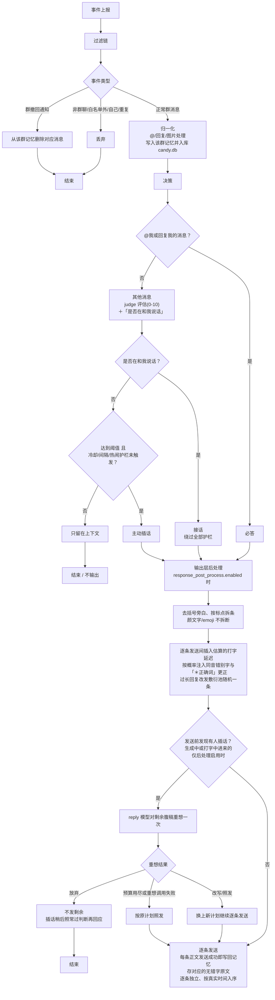

# CandyBot

一个通过 SnowLuma 参与 QQ 群聊讨论的 AI 机器人。

- **收消息**：SnowLuma 通过 OneBot v11 HTTP POST 把事件上报到 CandyBot 内置的 aiohttp 服务；
- **发消息**：全部经由 SnowLuma 的 MCP server（stdio 启动 `@snowluma/mcp`，write 模式 `invoke_action("send_group_msg")`）；
- **大脑**：OpenAI 兼容 API。`judge` 模型逐条评估「是否值得回复这条消息」打 0-10 分，超过阈值才插话，并同时识别「这条消息是否在和我说话」（对话中的追问不受冷却限制）；@机器人/回复机器人必答，由 `reply` 模型生成回复；可选 `vision` 模型把图片转成文字描述。

## 快速开始

```bash
uv sync                          # 安装依赖
uv run pytest                    # 跑测试
uv run main.py                   # 启动
```

### 前置条件

1. **SnowLuma 实例**已部署并登录 QQ（WebUI 默认 <http://127.0.0.1:5099>）。
2. 在 SnowLuma WebUI 的「网络适配器」里：
   - **HTTP 服务端**已启用（默认 http://127.0.0.1:3000/ ），记下 accessToken；
   - **HTTP 上报（client）** 新增一条，URL 填 http://127.0.0.1:5700/onebot/event ，勾选消息事件。
3. Node.js ≥ 22（MCP 子进程需要）。
4. 编辑 `config.json5`（JSON5 格式，支持 `//` 注释；见下文逐项说明），至少改掉 `bot.self_qq`、`ai_backend.api_key`、`snowluma.api_key`，并把要服务的群号写进 `groups` 且 `enabled: true`。

## 配置项说明（config.json5）

| 段                    | 字段                                                            | 说明                                                                                                                                                                                                                                                                                                       |
|-----------------------|-----------------------------------------------------------------|------------------------------------------------------------------------------------------------------------------------------------------------------------------------------------------------------------------------------------------------------------------------------------------------------------|
| bot                   | self_qq                                                         | 机器人自己的 QQ 号，用于识别 @我 / 回复我 / 过滤自己消息                                                                                                                                                                                                                                                   |
|                       | listen_host / listen_port                                       | 事件上报服务监听地址（默认仅本机）                                                                                                                                                                                                                                                                         |
|                       | event_secret                                                    | 非 null 时校验上报请求的 HMAC-SHA1 签名（OneBot v11 标准）                                                                                                                                                                                                                                                 |
|                       | data_dir                                                        | 记忆等运行时数据的目录                                                                                                                                                                                                                                                                                     |
|                       | log_level                                                       | 日志级别：DEBUG/INFO/WARNING/ERROR/CRITICAL（默认 INFO）。设 DEBUG 可查看每次 LLM 请求的完整 prompt 与收到的消息                                                                                                                                                                                           |
| groups                | （群号为键）                                                    | **白名单**。只有列出的群会被服务；条目内可覆盖下表全部人设与护栏参数，留空/-1/null 表示继承 groups_default；`enabled: false` 单独禁用该群                                                                                                                                                                  |
|                       | — 特例                                                          | `groups` 为空对象且 `groups_default.enabled=true` 时服务所有群（不建议）                                                                                                                                                                                                                                   |
| groups_default        | persona                                                         | 人设；以下护栏参数缺省(-1)时使用内置默认值：                                                                                                                                                                                                                                                               |
|                       | proactivity_threshold                                           | judge 打分达到该值才主动发言（0-10）                                                                                                                                                                                                                                                                       |
|                       | cooldown_seconds                                                | 主动发言后的冷却秒数，冷却期内直接跳过判定（@必答不受限）                                                                                                                                                                                                                                                  |
|                       | context_size                                                    | 喂给模型的上下文消息条数（默认 20）                                                                                                                                                                                                                                                                        |
|                       | min_gap_messages                                                | 自己上次发言后需攒够这么多条他人消息才会再次评估主动发言（默认 3）；0 关闭                                                                                                                                                                                                                                 |
|                       | busy_rate_per_min                                               | 最近 60 秒群内消息达到该条数即整体静默（默认 6），避免在多人接龙时硬插话；0 关闭                                                                                                                                                                                                                           |
| ai_backend            | base_url / api_key                                              | 全局默认提供商：models 条目未写 base_url / api_key 时继承这里；api_key 也可留空改经环境变量 OPENAI_API_KEY 提供（本地无密钥端点自动用占位符）                                                                                                                                                              |
| models                | judge                                                           | 判断是否参与话题的模型（建议便宜快速的，如 glm-4-flash）。三种角色可来自不同提供商，见下行                                                                                                                                                                                                                 |
|                       | reply                                                           | 参与回答生成回复的模型。每个角色既可写模型名字符串（继承 ai_backend），也可写对象覆盖 `base_url` / `api_key`，并配置 `context_window`（上下文窗口，token，用于约束历史长度）与 `max_output_tokens`（单次输出上限）                                                                                         |
|                       | vision                                                          | 视觉模型：describe 模式的转述、direct 模式收图入库时的总结/保留判定都靠它；同样支持按模型覆盖提供商与限额                                                                                                                                                                                                  |
|                       | （各角色均可加 `tool_use`）                                     | 模型是否支持工具调用（默认 `true`）。判定/回复/入库评估默认经强制工具调用提交结构化结果；`false` 时该角色走纯文本协议（judge 在正文输出 JSON，reply 用末尾 `<drop_img>/<recall_img>` 标记），提示词契约随之一致。运行中若端点报工具相关错误或忽略 `tools` 参数，该角色也会自动降级为纯文本协议并记警告日志 |
|                       | （各角色均可加 `forced_tool_choice`）                           | 是否强制指定工具（`tool_choice=required`，默认 `true`）。思考（thinking）模式的模型普遍不支持 required/object 强制指定（如 qwen3 系列直接报 400）：这类模型设为 `false`，请求改用 `tool_choice="auto"` 并由提示词引导模型主动调用；模型没调用工具时同样自动降级为纯文本协议                                |
| generation            | reply_max_tokens / temperature                                  | 回复生成长度与随机性（reply 模型配置了 max_output_tokens 时以其为准）                                                                                                                                                                                                                                      |
|                       | max_context_chars                                               | 喂给模型的历史上下文总字符上限                                                                                                                                                                                                                                                                             |
|                       | timeout_seconds                                                 | 单次 LLM 调用超时                                                                                                                                                                                                                                                                                          |
|                       | recheck_enabled / recheck_min_score                             | 门槛复核（复评）开关与触发下限：首评分严格高于下限却未达群门槛时把真实门槛告知 judge 再裁一次（默认开 / 下限 5，范围 0-10）                                                                                                                                                                                |
|                       | max_history_images                                              | direct 模式下历史层最多同时传入的原图张数，超出从最旧的开始摘除（默认 8）                                                                                                                                                                                                                                  |
| multimodal            | mode                                                            | `placeholder` 图片→"[图片]"；`describe` 视觉模型转文字；`direct` 图片 base64 直传并支持图片记忆管理（要求 reply 模型多模态）。三种模式下图片 base64 都会随聊天记录入库，重启不丢失                                                                                                                         |
|                       | download_media                                                  | 是否下载图片。关掉后连本地存档也没有，所有模式一律只见占位符                                                                                                                                                                                                                                               |
| storage               | image_retention_days                                            | 聊天原图保留天数（默认 7）：超期自动回收为总结/占位符；文本历史永久保留。整段可省略                                                                                                                                                                                                                        |
| rate_limit            | global_daily_limit                                              | 全局每日主动发言上限，null 不限（@必答不受限）。一条正文都没实际发出（重想全部放弃或首条即发送失败）时不计数，会退还配额                                                                                                                                                                                   |
| response_post_process | enabled                                                         | 输出层拟人化后处理总开关（默认 true）。`false` 时回复整条单发、无任何延迟、不触发连发被打断后的重想，行为与未引入后处理前完全一致；整段配置可省略                                                                                                                                                          |
|                       | typing_speed                                                    | 打字延迟全局倍率（默认 1.0，0 关闭延迟；须为非负有限数）：第 2 条起按下一条文本的估算打字时长 sleep 后再发送，单条封顶 60 秒                                                                                                                                                                               |
|                       | max_split / max_length                                          | 一次回复最多拆成几条（默认 3，超出上限的句子并入最后一条）；单条超过该字数（默认 120，按显示字数计：emoji/颜文字序列整体算 1 字）则不发送原文，改从敷衍池随机抽一条（默认 7）                                                                                                                              |
|                       | keep_strong_punctuation                                         | 拆条时句末 `! ?`（含全角 `！ ？`）是否保留（默认 true）；其余句末标点（。 ， ； … 等）总是去掉                                                                                                                                                                                                             |
|                       | typo_error_rate / typo_tone_error_rate / typo_word_replace_rate | 错别字三率（默认 0.05 / 0.3 / 0.2）：单字同音替换概率、替换时打错声调的概率、整词替换为同音词的概率（基于 pypinyin）                                                                                                                                                                                       |
|                       | typo_polyphone_mode                                             | 多音字错字策略（默认 `word_reading`）：`word_reading` 取词典词内读音照常替换（「银行」的行按 háng 出同音错字）；`skip` 多音字整体跳过、只替换单读音字。两种模式下读音无法确定时（多音字单独成词等）都绝不替换，避免产出读音对不上的「假同音」错字                                                          |
|                       | typo_correction_probability                                     | 出现错字后追加一条「＊正确词」更正消息的概率（默认 0.5）。更正经 OneBot v11 reply 消息段引用最后一条正文发送（响应无 message_id 时退回无引用纯文本并记警告）。更正只面向群友：写回记忆的是无错字原文，错别字不进入 L3 历史                                                                                 |
|                       | lazy_replies                                                    | 敷衍池（默认 呃呃/不晓得/懒得说/不知道/emm）：回复过长或清洗后无内容时随机抽一条代替发送                                                                                                                                                                                                                   |
| snowluma              | mcp_command / mcp_args                                          | MCP server 启动命令（默认 npx -y @snowluma/mcp）                                                                                                                                                                                                                                                           |
|                       | endpoint                                                        | SnowLuma OneBot HTTP 端点；**允许私网需显式设置 allow_private_endpoint=true**                                                                                                                                                                                                                              |
|                       | api_key                                                         | accessToken，作为 Bearer token 传给 MCP                                                                                                                                                                                                                                                                    |
|                       | mode                                                            | 必须 `"write"`，否则无法发言                                                                                                                                                                                                                                                                               |

`bot.self_qq` 也可在机器人名字上体现——发送的记忆里机器人昵称固定为「糖糖」，若你在 persona 里另取了名字请保持一致或修改 `candybot/bot.py` 中的昵称常量。

## 配置热重载

程序监听 `config.json5` 所在目录（而非文件本身，编辑器原子保存会替换 inode、单文件 watch 会静默失效），保存后自动重新解析并替换运行时配置，日志出现「配置文件被修改，正在重载」即成功；配置写坏时完整记录解析错误并沿用旧配置继续运行，修好再保存自动恢复（替换动作在事件循环线程上执行，与消息处理串行）。

- **改完即时生效**：`groups` 白名单（增删群、启停）、persona 与各群覆盖参数、护栏阈值、`context_size`、`models`（端点/密钥/限额，会重建 AI 客户端，工具协议降级状态随之重置）、`generation`、`multimodal`、`response_post_process`、`rate_limit`、`storage.image_retention_days`、`bot.self_qq`、`bot.log_level`。
- **仍需重启**：`bot.listen_host` / `bot.listen_port` / `bot.event_secret`（aiohttp 监听与签名校验在启动时已绑定）、`bot.data_dir`、`snowluma.*`（MCP 子进程会话）。另外热缓存容量按启动时的全局最大 `context_size` 定死，把它改大超过该上限时历史会偏短并有警告日志，完全生效需重启。

## 行为逻辑



- 每个群一条串行决策队列，保证顺序；回复生成异步执行不阻塞后续消息。
- judge 会为每条普通消息同时给出分数和「是否在和我说话」（to_me）标记：被判为对话延续的消息视为接话而非插话，绕过全部护栏放行，也不刷新冷却；只有主动插话受三层结构性节制（都可通过配置调整或关闭，@必答不受限）——主动发言后的 `cooldown_seconds` 冷却 → 发言后至少隔 `min_gap_messages` 条他人消息 → 近一分钟消息量超过 `busy_rate_per_min` 时静默。
- judge 失败按不发言处理；reply 失败重试 2 次；发送失败重试 3 次。
- 拟人化拆条：第一条不留打字延迟（LLM 生成耗时本身就是自然延迟），第 2 条起先按下一条文本估算打字时长（中文 0.3 秒/字、英文数字 0.15 秒/字、emoji/颜文字各 1 秒、单字回复 3 倍，乘 `typing_speed`，单条封顶 60 秒以免堵死该群队列）再发送；每条仍各自走 3 次重试，中途失败放弃剩余条目：一条都没发出去时退还日配额、不刷新冷却与间隔，已发出过至少一条则照常记账。错别字与更正只是表层噪音，写回记忆的是与发送逐条对齐的无错字原文，避免污染 L3 历史；且写回跟着发送走——每条正文发送成功后立即单独入库，连发（打字延迟）期间穿插进来的他人消息因此落在真实的时间位置，自己的多条发言在模型的聊天历史里也是各自独立的 assistant 回合，不会被合并成一段挤到插话消息之后。启用错别字时，拼音反查表（构建约 0.6 秒）在 `bot.start()` 的后台线程预建，不会卡事件循环。
- 连发被打断会先「重想」：每条正文发出前，若基线之后有新他人的消息入库（回复生成中或打字延迟中进来的都算），bot 会先问一次 reply 模型——已发出的收不回，还没发的只是腹稿，看着插话决定放弃、改写还是照发（空正文＝不发了，插话那条随后照常进入 judge 并得到自然回应）。一轮连发最多重想 2 次，预算用尽或该次调用失败就按原计划发完；模型一字不改地要继续时（忽略行间空白与空行差异）直接沿用原计划（连同已掷好的错别字与更正），未发出的腹稿从不进入记忆与群消息。
- 重启后每群记忆自动从 `data/candy.db` 恢复最近上下文（热缓存容量仍按 context 配置有界）。

## 图片记忆管理

无论 `multimodal.mode` 是哪种（`download_media` 开启时），收到的图片都会转 base64 写进 SQLite 库 `data/candy.db`，作为本地存档（超过 `storage.image_retention_days` 的原图按天回收为总结/占位符，文本与总结永久保留）；区别只在于「后续对话里模型看到什么」：

- **placeholder**：模型永远只见 `[图片]` 占位符，base64 只落盘备查；
- **describe**：入库时视觉模型把图转成文字描述写进正文（现有行为）；
- **direct**：收图时 vision 模型一次性给出总结并判定「后续对话是否还需要看这张原图」。判定保留则下次起历史层把原图以内容块形式继续传给 reply 模型；否则转为 `[图片：<总结>]` 的文字历史。要求 reply 模型多模态、vision 模型已配置（两者缺一时保守退回继续展示原图）。

在 direct 模式下 reply 模型还能自己管理图片的生命周期：reply 角色启用工具调用时经 `send_reply` 工具参数提交（操作不会出现在发送到群里的正文里）；该角色 `tool_use: false` 或被自动降级时按旧约定在回复末尾写标记、发送前剥除：

| 提交方式                                            | 作用                                                                                                  |
|-----------------------------------------------------|-------------------------------------------------------------------------------------------------------|
| `drop_img: [消息编号…]` / `<drop_img 消息编号>`     | 认为某条历史消息的原图之后用不到了 → 收起原图，改为展示它的总结（没有总结则用占位符）                 |
| `recall_img: [消息编号…]` / `<recall_img 消息编号>` | 需要重新查看某张此前已被收起的旧图 → 该图恢复原图展示；若本轮就用到，会基于召回后的上下文重写一次回复 |

消息编号即历史里每行开头的 `#数字`。降级与召回都会同步入库，重启不丢；`generation.max_history_images` 限制历史层最多同时携带多少张原图（超出从最旧的摘除），防止 token 失控。撤回带图消息时，随记录删除的还有其存档。

图片按内容全局去重：内容完全相同的图（含同一条消息里的重复图）以整条 data URL 的 SHA-256 为指纹存入 `image_blob` 表，全库只保留一份 base64，各消息槽位共享引用；某条引用随撤回消失后，只要还有其他消息引用同一张图，原图就继续保留。原图超过 `storage.image_retention_days` 后由每日定时任务回收（启动时也会先回收一次）：槽位降级为总结（有总结）或占位符（无总结），记录本身与文本永久保留，不再被引用的原图数据随即释放。

## KV Cache 优化

提示词按稳定性严格分四层（详见 `candybot/prompts.py` 模块注释）：

1. system·静态层：persona + 守则，字节级不变；
2. system·状态层：群号、当天日期、成员昵称表（天内稳定）；
3. 历史层：只追加、从头整块淘汰，绝不重排；
4. user·指令层：秒级时间、触发类型等易变信息全部压到最后一层。

相邻两次调用中 L1-L3 构成完全相同的前缀，API 侧前缀缓存命中率最大化。

## 部署后测试清单

1. **启动自检**
   ```bash
   uv run main.py
   ```
   日志应依次出现：「SnowLuma MCP 会话已建立」→ 工具列表含 `invoke_action` → 「事件服务已启动」→ 「CandyBot 已就绪」。若报配置错误按提示改 config.json5。

2. **@必答**：在白名单群里 @机器人 说一句话 → 几秒内收到回复，日志无「兴趣评分」行（judge 未被调用）。

3. **阈值行为**：普通闲聊 → 日志出现 `回复判定 X/阈值 8`。首评时模型并不知道门槛（避免它围着门槛打分）；若 X 严格高于复核下限（`generation.recheck_min_score`，默认 5）却未达门槛，说明首评有高估嫌疑，会自动触发一次复核——日志出现 `回复复核 首评 X → 复评 Y/阈值 Z`，把真实门槛告知 judge 后请其重新仔细斟酌是否真的需要开口，复评达标才发言；复评未达标或复核调用失败则保持安静。该复核可用 `generation.recheck_enabled: false` 整体关闭，此时首评分数直接采信。下限与门槛构成开区间 `(recheck_min_score, proactivity_threshold)`，两个值相等或倒挂时该群实际上不会触发复核。judge 提示词要求如实按锚点打分：只有「有人在等我回应」的消息才应达到门槛（9-10 分），「自己在别人对话里插不上话」「可接可不接」都应低于门槛；若实机仍偏吵，优先调大 `cooldown_seconds` / `min_gap_messages` / `busy_rate_per_min`，其次把该群的 `proactivity_threshold` 调到 9，再次改 persona。

4. **冷却与对话延续**：主动发言后拿「与它无关的新话题」发多条 → 日志仍出现判定行但消息被冷却/间隔/热闹护栏拦下（DEBUG 可见跳过原因），不会发送；而群友用文字接着追问它刚说过的话（非 @）→ 判定行带 `[与我对话]` 标记并正常回复，即使冷却未过。攒够 `min_gap_messages` 条他人消息、且近一分钟消息频率降下来后，恢复主动插话。

5. **记忆持久化**：和它聊几句 → Ctrl+C 退出 → 再启动后引用它上一场说的话（回复那条消息），它能理解语境。

6. **多模态**：切 `multimodal.mode=describe` 并配 vision 模型 → 发一张图，日志里该消息文本变为 `[图片：<描述>]`。

7. **图片记忆（direct）**：切 `multimodal.mode=direct` 并配 vision → 发一张信息量大的图（如截图文字），DEBUG 日志里图片评估经 `submit_assessment` 工具提交 `"keep": true`，后续对话历史层持续携带原图；再发一张表情包则 `"keep": false`，历史只剩 `[图片：<总结>]`。对话中让它「把刚才那张图收起来」→ 日志出现「已按模型指令收起」且库中该消息的 `image_states` 变为 summarized/placeholder；说「把之前那张图翻出来看看」→ 出现召回日志、回复基于原图重写。placeholder 模式下发图：`chat_image`/`image_blob` 表里仍有 base64，但 DEBUG 的 prompt 里只有 `[图片]`。

8. **调积极性**：觉得它话太少就把 `proactivity_threshold` 从 8 调到 6-7、缩短冷却或关掉护栏（对应参数设 0）；太吵则反向调整——加大 `cooldown_seconds`、`min_gap_messages` 调到 5-8、`busy_rate_per_min` 调低。

## 开发

```bash
uv run pytest           # 全部测试
uv run pytest -k names  # 单测命名过滤
```

### 查看每次请求的完整 Prompt

把 config.json5 的 `bot.log_level` 设为 `"DEBUG"` 后重启即可在日志里看到 judge / reply / vision 每次请求的完整消息数组（含分层内容；多模态图片只显示长度和头部片段），以及每条收到消息、冷却跳过等细节：

```json5
{
    "bot": {
        "log_level": "DEBUG",
        // ...
    }
}
```

配置错误（非法级别名）会在启动时直接报错，便于及时发现。

模块速览：`models.py`(领域模型+配置校验+SSRF 校验) · `normalize.py`(OneBot→内部消息) · `memory.py`(群记忆：热缓存+生命周期) · `database.py`(SQLModel 表定义+candy.db 异步读写) · `events_server.py`(aiohttp 接收) · `snowluma.py`(MCP 客户端) · `prompts.py`(KV Cache 分层提示词) · `ai.py`(LLM 三角色) · `postprocess.py`(输出层拟人化：拆条/打字延迟/错别字/敷衍兜底) · `bot.py`(编排)。
